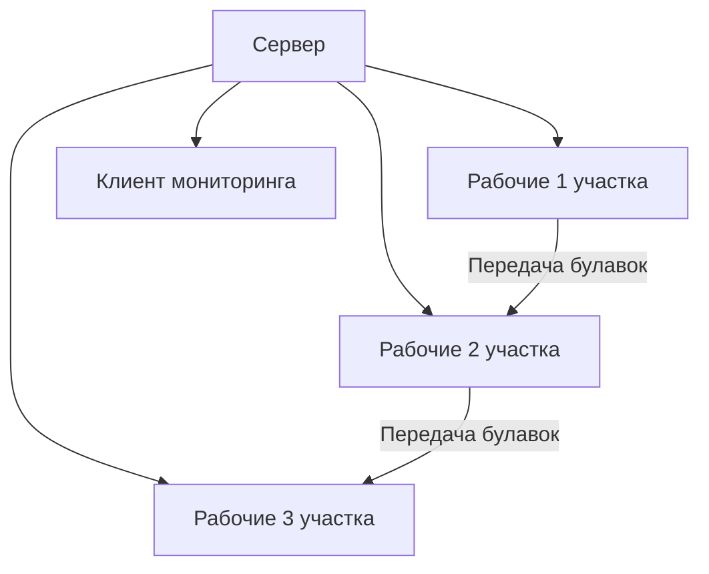

**ФИО исполнителя:** Малова Олеся Андреевна  
**Группа:** БПИ238
**Номер варианта:** 28

# Отчет на 8 балллов

## 1. Архитектура системы

### 1.1 Компоненты системы

1. **Сервер**:
   - Координация работы всех участков
   - Управление очередями булавок
   - Сбор статистики
   - Обслуживание подключений

2. **Рабочие клиенты** (3 типа):
   - Проверка кривизны
   - Заточка булавок
   - Контроль качества

3. **Клиент мониторинга**:
   - Отображение полной информации о системе
   - Визуализация статистики

### 2.2 Взаимодействие компонентов

### Результаты работы

===== PIN FACTORY MONITOR =====
Total pins processed: 42
Pins rejected (curved): 8

Pins in stage 1 (checking): 3
Pins in stage 2 (sharpening): 2
Pins in stage 3 (quality control): 1

Workers in stage 1: 2
Workers in stage 2: 3
Workers in stage 3: 1
= ============================ =
